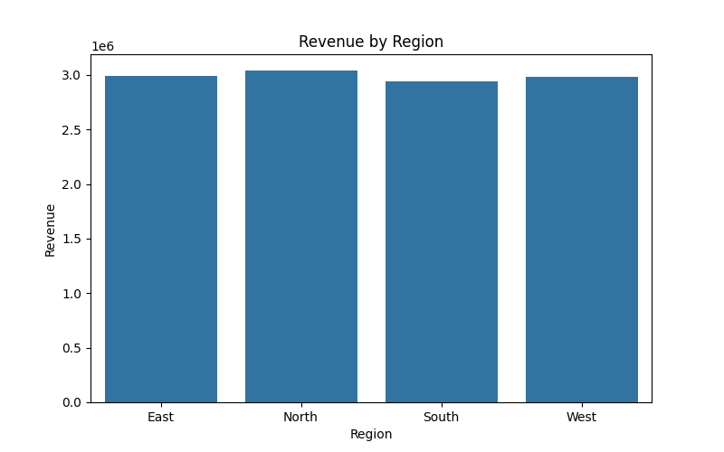
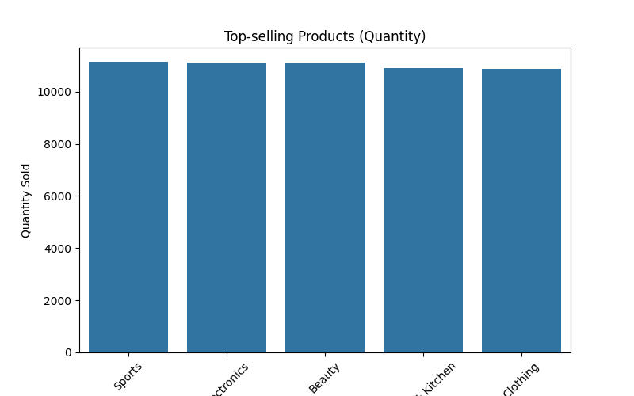
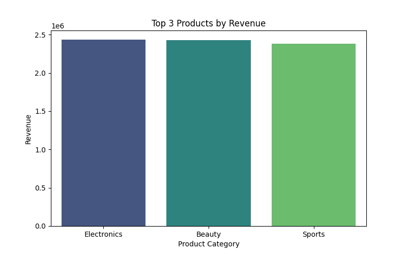
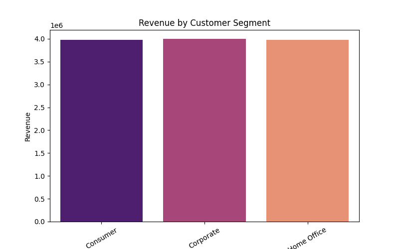
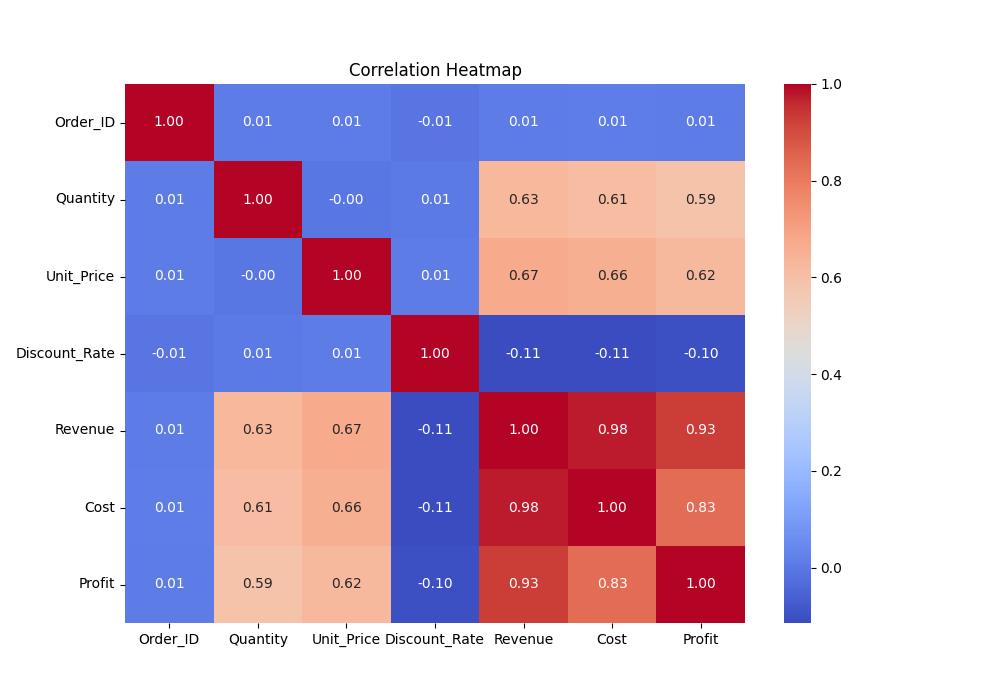

# Sales Dashboard Project

An interactive sales dashboard built using python,Streamlit,Pandas,Seaborn, and Matplotlib.  
This dashboard visualizes sales trends, revenue, profit, top products, and customer segments to help businesses make data-driven decisions.

---

## Features
- Displays total **Revenue** and **Profit**
- Revenue & Profit by **Region** and **Payment Method**
- Highlights **Top-selling Products** and **Top 3 Product Categories**
- Monthly **Revenue & Profit Trends**
- **Correlation Heatmap** of numerical data
- Revenue by **Customer Segment**
- Interactive and visually appealing charts using **Streamlit**

---

## Tech Stack
- **Python**
- **Streamlit**
- **Pandas**
- **NumPy**
- **Matplotlib**
- **Seaborn**

---

## Screenshots

**Revenue by Region:**  


**Top Products by Quantity:**  


**Monthly Revenue & Profit:**  


**Top 3 Products by Revenue:**  


**Revenue by Customer Segment:**  


**Correlation Heatmap:**  


---

## How to Run
1. Clone the repository:
   ```bash
   git clone https://github.com/ChanchalDonekar/sales-dashboard.git
